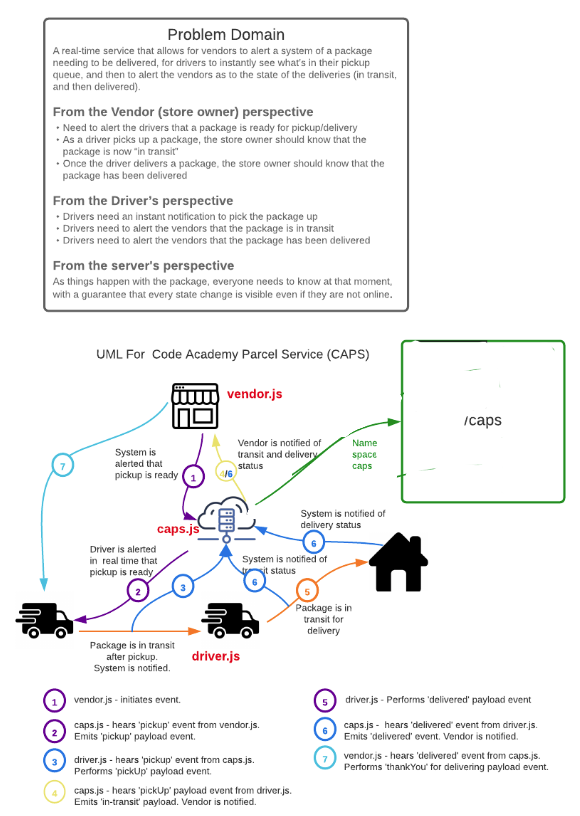

# Lab 12:CAPS-Socket.io (vendor.js)
## Authors: Taylor Thornton & Clement Buchanan

This element of our socket.io API acts as a client to the /caps namespace created in the caps.js app.  In this file, we bring in socket.io-client as well as a declared host.  For this case we are using 'http://localhost:3000'.  We then make a connection to the caps name space. Client emits events `'pickup'` and listens for `'delivered'` (which is emitted by driver.js) event and runs code accordingly.  

## Setup
- npm init
- Install dependencies: faker.js, socket.io@2, socket.io-client@2, dotenv
- in your local environment, create a .env to declare PORT and STORE_NAME

## Returns Object (Sample)
- uses faker.js to create mock orders using setInterval
- listens for `'delivered'` --> this prompts a logged message 
- SAMPLE:
`{
  storeName: '1-800-buystuff',
  address: '6415 Kristy Ports Simonisview, Virginia  06118-9868',
  customerName: 'Leannon, Krystel',
  orderId: 20588
}
VENDOR: thank you for delivery 20588`

## Tests (in progress)
- Unit tests: npm run test

## UML

